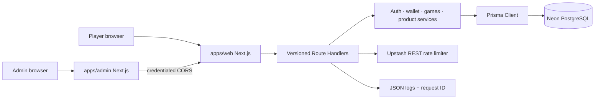
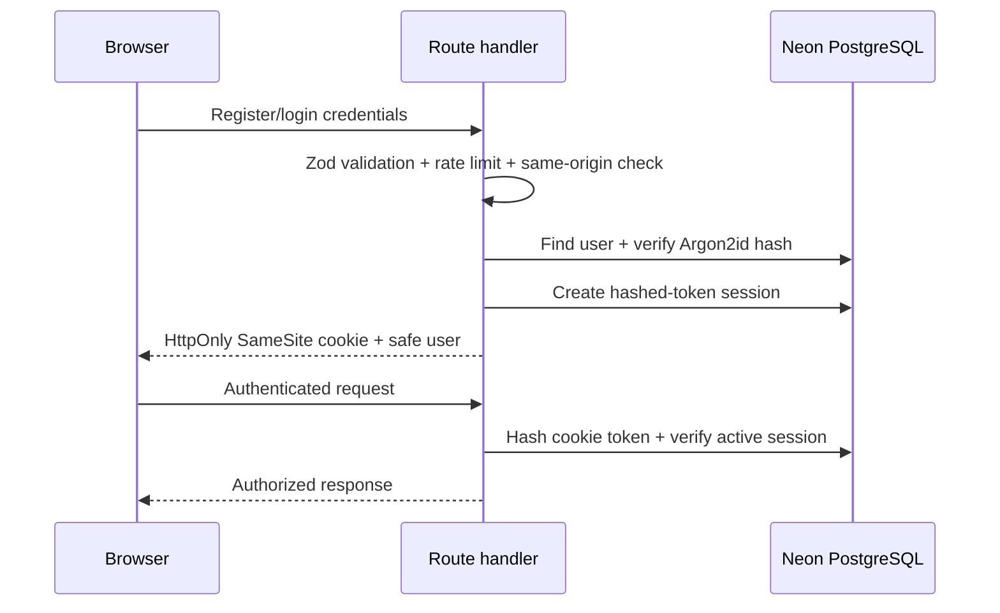
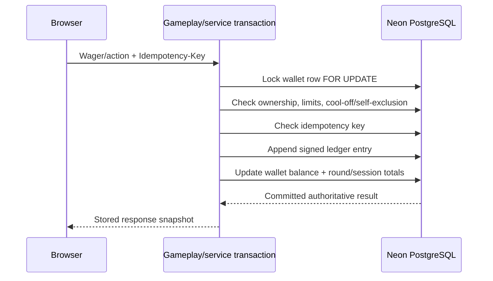
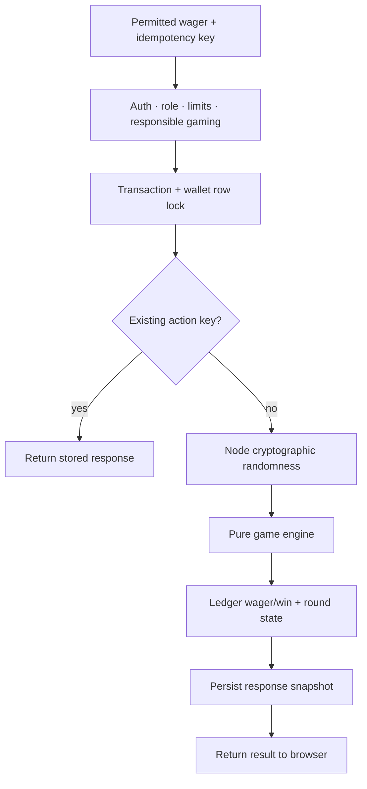
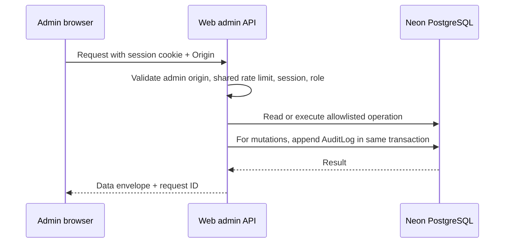

# Veltrix architecture diagrams

These diagrams describe the current Phase 1–7 system. PostgreSQL/Neon and Prisma remain the source of truth; browser state is never authoritative for identity, wallet balance, eligibility, or game outcomes.

## Overall request flow

## Authentication and session lifecycle

## Wallet and ledger mutation

## Server-authoritative game round

## Admin authorization and audit

